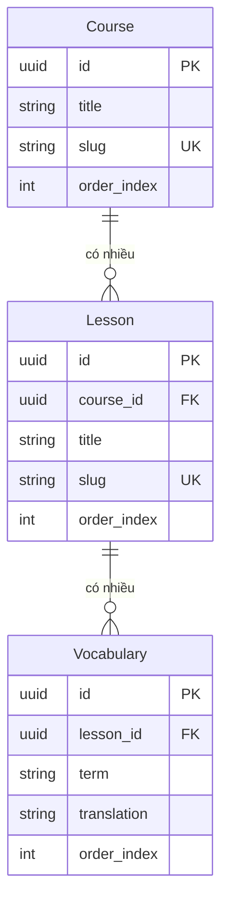

# Database Schema — SpeakUp

> ⚠️ Schema này đã được triển khai thông qua **TypeORM Entities**. Toàn bộ các bảng đều hỗ trợ lưu trữ dữ liệu học tập và quản lý người dùng.

## Bảng chính (Entities)

### `User` (Bảng `profiles`)
Lưu trữ thông tin chi tiết của người học, mở rộng từ bảng `auth.users` của Supabase.
- `id`: Định danh duy nhất (UUID), khớp với ID từ Supabase Auth.
- `email`: Địa chỉ email của người dùng (đồng bộ từ auth.users).
- `username`: Tên người dùng hiển thị trên hệ thống.
- `role`: Phân quyền (ví dụ: `learner` cho học viên, `admin` cho quản trị viên).
- `created_at`: Thời điểm tạo tài khoản.

```typescript
@Entity('profiles')
export class User {
  @PrimaryColumn('uuid') id: string; 
  @Column({ nullable: true }) email: string;
  @Column() username: string;
  @Column() role: string;           
  @CreateDateColumn() created_at: Date;
}
```

### `Course` (Bảng `courses`)
Chứa thông tin về các khóa học tiếng Anh.
- `id`: Định danh duy nhất (UUID).
- `title`: Tên khóa học (ví dụ: "Real English").
- `description`: Mô tả nội dung và mục tiêu của khóa học.
- `level`: Độ khó (`Cơ bản`, `Trung cấp`, `Nâng cao`, `Mọi cấp độ`).
- `thumbnail`: Đường dẫn đến ảnh đại diện (format: `/media/courses/{slug}/thumbnail/thumbnail.{ext}`).
- `order_index`: Thứ tự hiển thị của khóa học trong danh sách.
- `slug`: Đường dẫn thân thiện (ví dụ: `real-english`). Duy nhất và được đánh chỉ mục. Tự động sinh từ `title` qua hook `@BeforeInsert/@BeforeUpdate`.
- `created_at`: Thời điểm tạo.

```typescript
@Entity('courses')
export class Course {
  @PrimaryGeneratedColumn('uuid') id: string;
  @Column() title: string;
  @Column({ type: 'text', nullable: true }) description: string;
  @Column({ nullable: true }) level: string;          
  @Column({ nullable: true }) thumbnail: string;
  @Column({ default: 0 }) order_index: number;
  @Column({ unique: true }) @Index() slug: string;
  @OneToMany(() => Lesson, lesson => lesson.course) lessons: Lesson[];
  @CreateDateColumn() created_at: Date;
}
```

### `Lesson` (Bảng `lessons`)
Lưu trữ các bài học thuộc một khóa học. Mỗi bài học bao gồm nhiều thành phần (Main Article, Vocabulary, Mini Stories, POV, Commentary).
- `course_id`: Khóa ngoại liên kết với bảng `courses`.
- `title`: Tên bài học.
- `slug`: Đường dẫn thân thiện. Tự động sinh từ `title`.
- `order_index`: Thứ tự bài trong khóa học.
- `main_audio_url`: URL file audio bài học chính.
- `main_content_bilingual`: Dữ liệu bài đọc song ngữ (JSONB). Format: `[{ "en": "...", "vi": "..." }]`.
- `vocab_audio_url`: URL file audio phần từ vựng.
- `mini_stories`: Danh sách các câu chuyện mini (JSONB array). Mỗi item gồm `{ id, audio_url, vtt_url, title?, order_index? }`.
- `pov_audio_url`, `pov_vtt_url`: Audio và phụ đề cho phần Point of View.
- `commentary_audio_url`, `commentary_vtt_url`: Audio và phụ đề cho phần Commentary.

```typescript
@Entity('lessons')
export class Lesson {
  @PrimaryGeneratedColumn('uuid') id: string;
  @Column('uuid') course_id: string;
  @ManyToOne(() => Course, course => course.lessons) course: Course;
  @Column() title: string;
  @Column({ unique: true }) @Index() slug: string;
  @Column({ default: 0 }) order_index: number;
  @Column({ nullable: true }) main_audio_url: string;
  @Column({ type: 'jsonb', nullable: true }) main_content_bilingual: { en: string; vi: string }[];
  @Column({ nullable: true }) vocab_audio_url: string;
  @OneToMany(() => Vocabulary, v => v.lesson) vocabularies: Vocabulary[];
  @Column({ type: 'jsonb', nullable: true }) mini_stories: { id: string; audio_url: string; vtt_url: string; title?: string; order_index?: number }[];
  @Column({ nullable: true }) pov_audio_url: string;
  @Column({ nullable: true }) pov_vtt_url: string;
  @Column({ nullable: true }) commentary_audio_url: string;
  @Column({ nullable: true }) commentary_vtt_url: string;
  @CreateDateColumn() created_at: Date;
}
```

### `Vocabulary` (Bảng `vocabulary`)
Lưu trữ kho từ vựng đi kèm theo từng bài học.
- `lesson_id`: Liên kết với bài học chứa từ vựng này.
- `term`: Từ/cụm từ tiếng Anh.
- `ipa`: Phiên âm quốc tế (IPA).
- `definition`: Định nghĩa tiếng Anh.
- `translation`: Nghĩa ngắn gọn tiếng Việt (hiển thị chính trên UI Learner).
- `definition_vi`: Giải nghĩa chi tiết bằng tiếng Việt.
- `example`: Câu ví dụ sử dụng từ.
- `word_type`: Loại từ (`noun`, `verb`, `adj`, `adv`...).
- `audio_url`: Đường dẫn file phát âm của từ (có thể là URL bên ngoài hoặc đường dẫn nội bộ).
- `order_index`: Thứ tự hiển thị (hỗ trợ kéo thả sắp xếp trong Admin).
- `created_at`: Thời điểm tạo.

```typescript
@Entity('vocabulary')
export class Vocabulary {
  @PrimaryGeneratedColumn('uuid') id: string;
  @Column('uuid') lesson_id: string;
  @ManyToOne(() => Lesson, lesson => lesson.vocabularies) lesson: Lesson;
  @Column() term: string;
  @Column({ nullable: true }) ipa: string;
  @Column({ type: 'text' }) definition: string;
  @Column({ type: 'text', nullable: true }) translation: string;
  @Column({ type: 'text', nullable: true }) definition_vi: string;
  @Column({ type: 'text', nullable: true }) example: string;
  @Column({ nullable: true }) word_type: string;
  @Column({ nullable: true }) audio_url: string;
  @Column({ default: 0 }) order_index: number;
  @CreateDateColumn() created_at: Date;
}
```

## Quan hệ giữa các bảng


